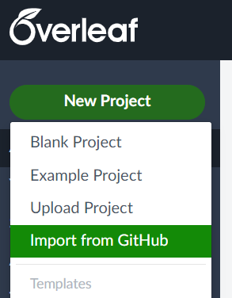

# PostDoc-Thesis-BUAA

BUAA Post-doctor thesis with topics on federated learning optimization algorithms.

~~Edited using [Overleaf](https://www.overleaf.com/).~~

## Usage

### Overleaf

NOTE: [Overleaf](https://www.overleaf.com/) is **NOT** recommended anymore, since [the compilation time limit was reduced from 4 minutes to 1 minute](https://www.overleaf.com/blog/changes-to-free-compile-timeouts-and-servers).

One can compile locally, or `Import from GitHub` using [Overleaf](https://www.overleaf.com/):



This project is compiled successfully with

```
Compiler: XeLaTeX
Tex Live version: 2022
```

### Local

Run the following command to compile locally:

```python
python compile.py
```

then the compiled PDF file will be in the `build` directory.

Alternatively, one can use `latexmk` directly:

```bash
mkdir -p build
latexmk -xelatex -f main.tex
```

## Code for the thesis

[fl-sim](https://github.com/wenh06/fl-sim): a simulation framework for federated learning, introduced in details in the [penultimate chapter](content/chapter5).
